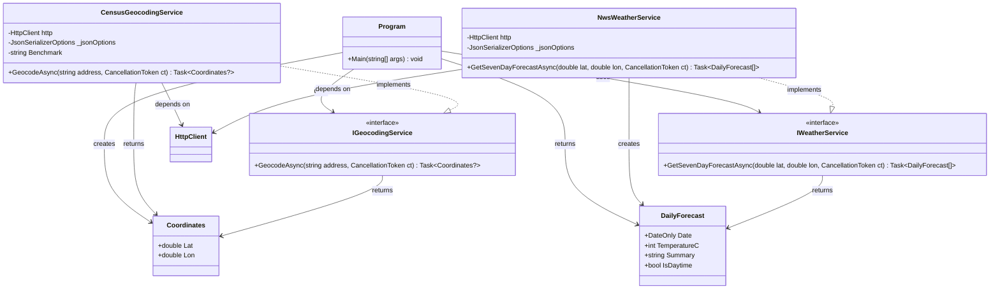
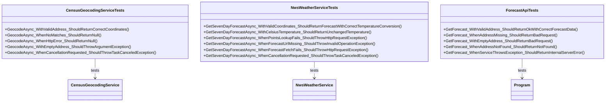

# Backend Architecture - Class Diagram

## UML Class Diagram



### **Models**

#### **Coordinates**
- **Type**: Data model
- **Responsibility**: Represents geographic coordinates
- **Properties**: 
  - `Lat`: Latitude (double)
  - `Lon`: Longitude (double)

#### **DailyForecast**
- **Type**: Data model  
- **Responsibility**: Represents weather forecast for a specific period
- **Properties**:
  - `Date`: Forecast date (DateOnly)
  - `TemperatureC`: Temperature in Celsius (int)
  - `Summary`: Weather description (string)
  - `IsDaytime`: Day/night indicator (bool)

## Dependency Flow

```
HTTP Request
     ↓
Program (API Endpoint)
     ↓
IGeocodingService
     ↓
CensusGeocodingService → Census API
     ↓
Coordinates
     ↓
IWeatherService
     ↓
NwsWeatherService → NWS API
     ↓
DailyForecast[]
     ↓
HTTP Response (JSON)
```

## Testing Architecture

